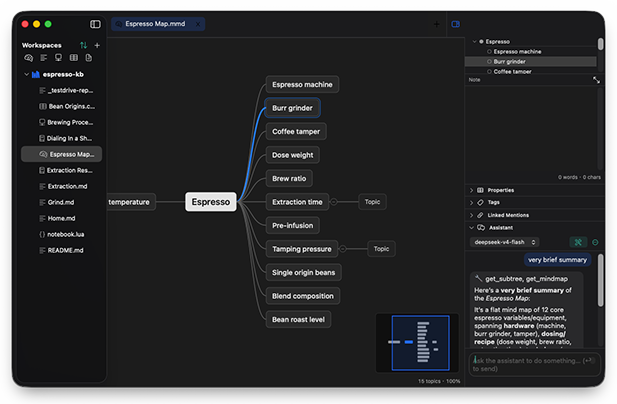

# Kep

A native macOS port of [Mindolph](https://github.com/mindolph/Mindolph) — personal-knowledge-management with mind maps, markdown, PlantUML, CSV, and multi-provider LLM integration.



## Status

Early scaffolding. Track progress via the `kep-swift-port` kanban project.

## Build

```bash
swift build
swift test
```

## Interactive testing

Three ways to actually run the app:

### 1. Quick — `swift run`

```bash
swift run Kep
```

The window opens immediately and is brought to the foreground (the
`KepAppDelegate` calls `NSApp.activate(ignoringOtherApps: true)`).
First-time UX: the sidebar is empty — use **File → Open Workspace…**
to pick a folder (e.g. the bundled `Examples/espresso-kb`).

### 2. Recommended — Xcode

```bash
open Package.swift
```

Pick the **Kep** scheme, ⌘R. Breakpoints, view debugger, SwiftUI
previews, and the memory graph all work.

### 3. Real `.app` bundle

```bash
./Scripts/make-icon.sh           # one-time — generates Resources/AppIcon.icns
./Scripts/make-app.sh
open build/Kep.app
```

Produces `build/Kep.app` with `Info.plist`, file-type associations
(`.mmd` / `.md` / `.puml` / `.mm`), Dock icon, and the Mindolph artwork.
`CONFIG=debug ./Scripts/make-app.sh` for a debug build.

### 4. Distributable DMG

```bash
./Scripts/make-dmg.sh            # → build/Kep-0.1.dmg
```

Drops the `.app` and a symlink to `/Applications` into a UDIF zlib-9
disk image. For App Store / notarized distribution add `codesign` +
`xcrun notarytool submit` (the script prints the commands).

### Sample data

`Examples/espresso-kb` is a bundled demo workspace exercising every file type:

- `Espresso Map.mmd` — mind map for testing the canvas.
- `Extraction.md` / `Grind.md` / `Home.md` — markdown editor + WKWebView preview.
- `Brewing Process.puml` — PlantUML; run `brew install plantuml graphviz`
  first or you'll see the install hint.
- `Bean Origins.csv` — drives the CSV table editor.
- `Extraction Research.mnb` / `Dialing In a Shot.mnb` — research notebooks
  (Lua + AI agent cells).

### Test scenarios worth a sweep

- Open a workspace via the **+** button (or **File → Open Workspace…**)
  — the sidebar walks the tree lazily, sorted folders-before-files.
- Click any `.mmd`. Try **Tab** (add child), **Enter** (sibling),
  **Delete** (remove), **-/=** (collapse/expand), **arrow keys**, ⌘Z /
  ⌘⇧Z (undo/redo), drag a topic onto another to reparent.
- Right-click a topic → **Add Note / Link / File / Image** (Image opens
  NSOpenPanel and base64-embeds the file).
- ⌘⇧J — **Insert Snippet…** (filtered by active file type).
- ⌘⇧G — **AI Generate…** (configure provider in **AI → Settings…** first;
  the OpenAI / Ollama / DeepSeek / Moonshot / Qwen providers are wired,
  Gemini / HuggingFace / ChatGLM stubbed).
- **File → Import FreeMind…** to convert `.mm` files.
- **File → Export → Markdown to PDF…** when a `.md` doc is active.
- **Window → Show / Hide Outline** (⌘⌥0), **Next / Previous Tab**
  (⌘⇧] / ⌘⇧[).

## Layout

```
Sources/
  KepModel/      .mmd parser/writer + Topic/Extra/MindMap (no UI)
  KepCore/       Workspace/Project/NodeData + file watching
  KepBase/       Editor protocols, theme, font icons
  KepMindMap/    Mind map canvas (NSView) + editor
  KepMarkdown/   Markdown editor with WKWebView preview
  KepPlantUML/   PlantUML editor (subprocess to plantuml.jar)
  KepCSV/        Visual CSV table editor
  KepGenAI/      LLM provider abstraction + chat panes
  Kep/           AppKit/SwiftUI app shell wiring everything
```

## Credits

Kep is a native macOS port of **[Mindolph](https://github.com/mindolph/Mindolph)**,
the original cross-platform PKM application written in Java by
[@mindolph](https://github.com/mindolph). All credit for the concept, the
`.mmd` format, and the feature set goes to that project — Kep aims for
behavior parity with it.

## License

Released under the Vibe-Coded License (functionally MIT). See [LICENSE](LICENSE).
